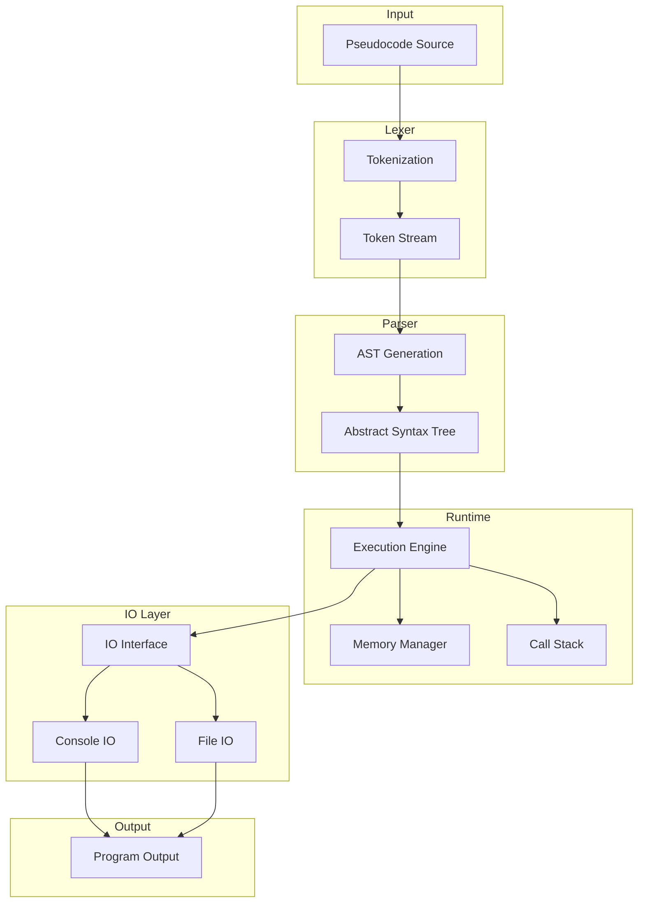
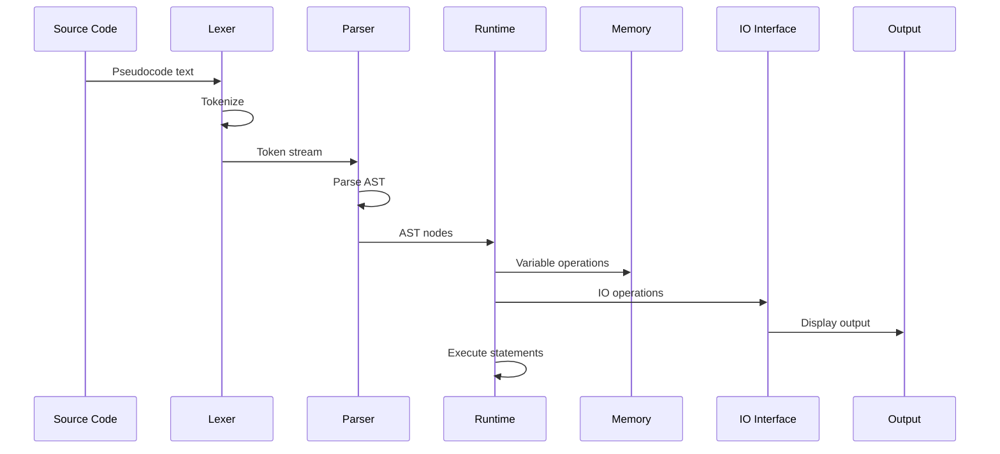
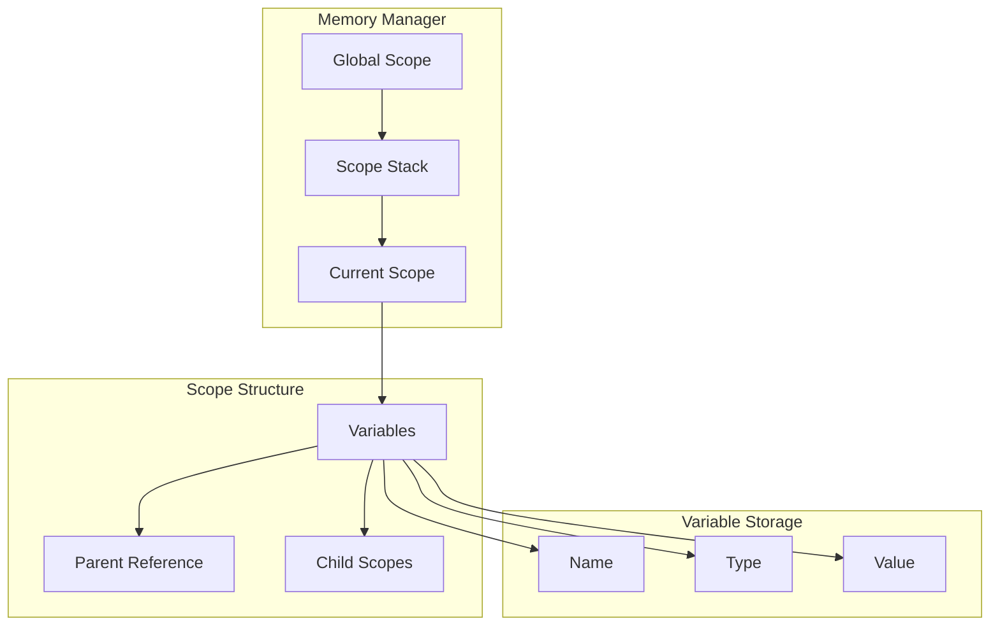
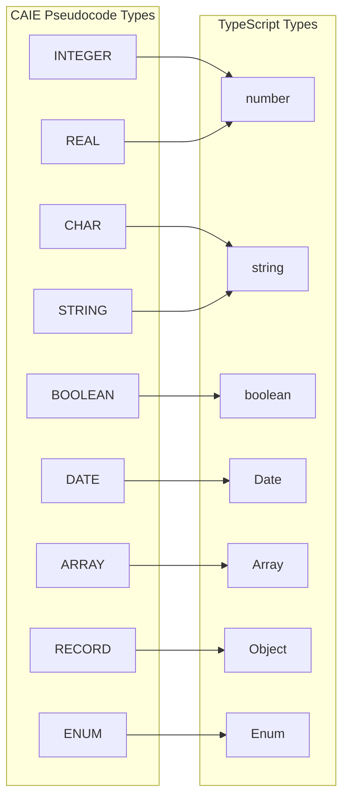
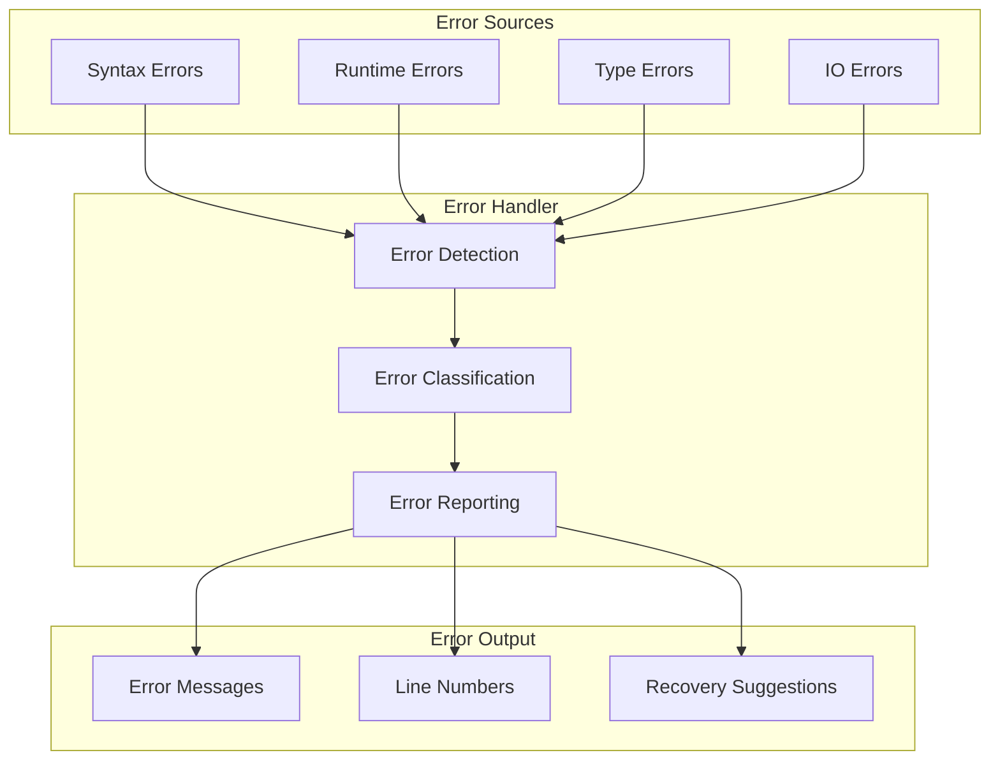
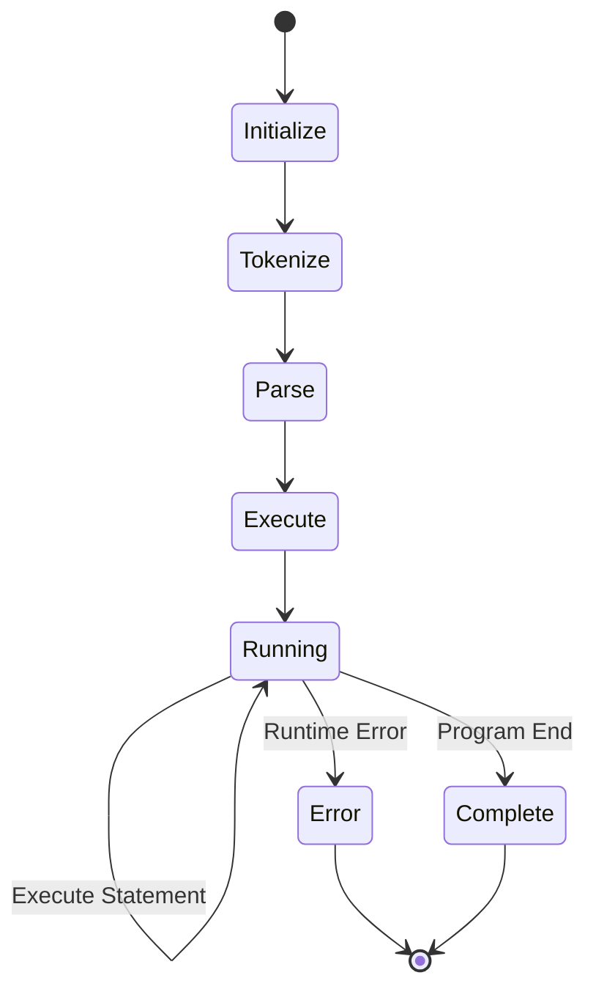

# CAIE Pseudocode Interpreter - Architecture Diagrams

## System Architecture Overview



## Component Interaction Flow



## Memory Management Architecture



## Type System Mapping



## Error Handling Flow



## IO Interface Abstraction

```mermaid
graph TD
    subgraph "Core IO Interface"
        A[IOInterface]
        B[input()]
        C[output()]
        D[readFile()]
        E[writeFile()]
        F[appendFile()]
        G[openRandomFile()]
        H[readRecord()]
        I[writeRecord()]
        J[closeFile()]
    end
    
    subgraph "Node.js Implementation"
        K[NodeIO]
        L[fs/promises]
        M[readline]
    end
    
    subgraph "Browser Implementation"
        N[BrowserIO]
        O[prompt()]
        P[alert()]
        Q[localStorage]
        R[IndexedDB]
    end
    
    subgraph "Custom Implementation"
        S[CustomIO]
        T[Custom Backend]
    end
    
    A --> K
    A --> N
    A --> S
    K --> L
    K --> M
    N --> O
    N --> P
    N --> Q
    N --> R
    S --> T
```

## Execution Flow



## Project Structure

```mermaid
graph TD
    subgraph "Root"
        A[src/]
        B[tests/]
        C[examples/]
        D[docs/]
    end
    
    subgraph "Source"
        E[core/]
        F[lexer/]
        G[parser/]
        H[runtime/]
        I[types/]
        J[io/]
        K[errors/]
        L[utils/]
    end
    
    subgraph "Core"
        M[interfaces.ts]
        N[types.ts]
    end
    
    subgraph "Lexer"
        O[lexer.ts]
        P[tokens.ts]
    end
    
    subgraph "Parser"
        Q[parser.ts]
        R[ast.ts]
    end
    
    subgraph "Runtime"
        S[runtime.ts]
        T[memory.ts]
        U[callstack.ts]
    end
    
    A --> E
    A --> F
    A --> G
    A --> H
    A --> I
    A --> J
    A --> K
    A --> L
    E --> M
    E --> N
    F --> O
    F --> P
    G --> Q
    G --> R
    H --> S
    H --> T
    H --> U